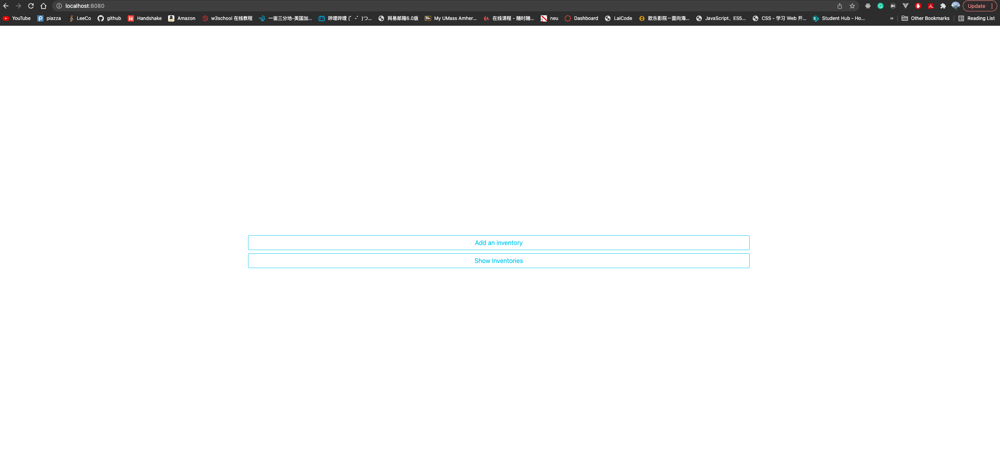
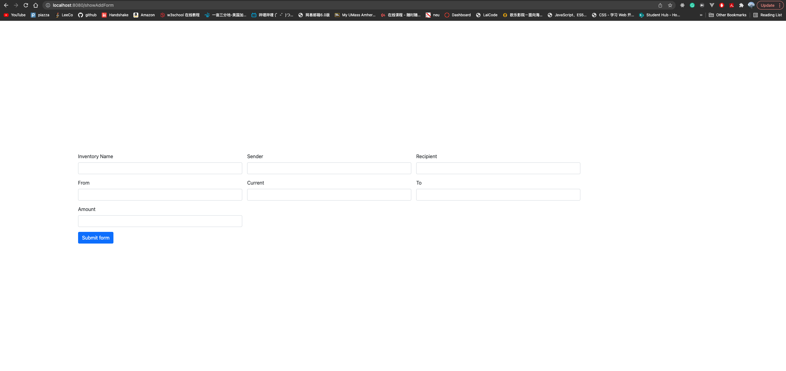
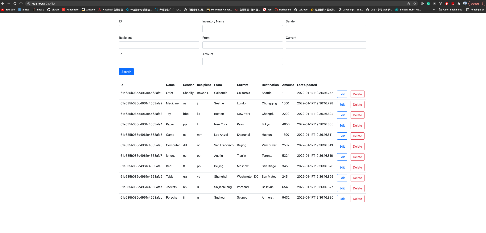
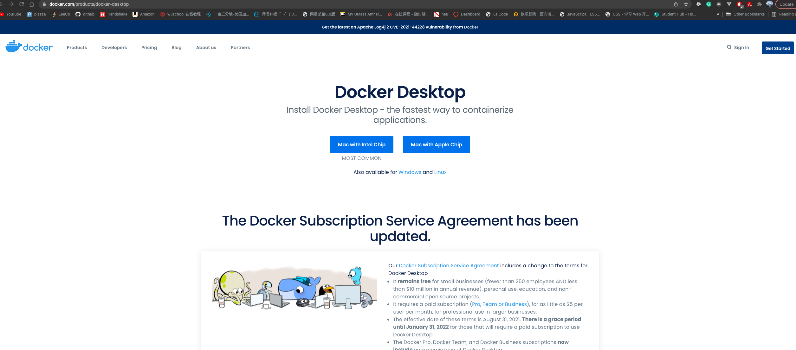
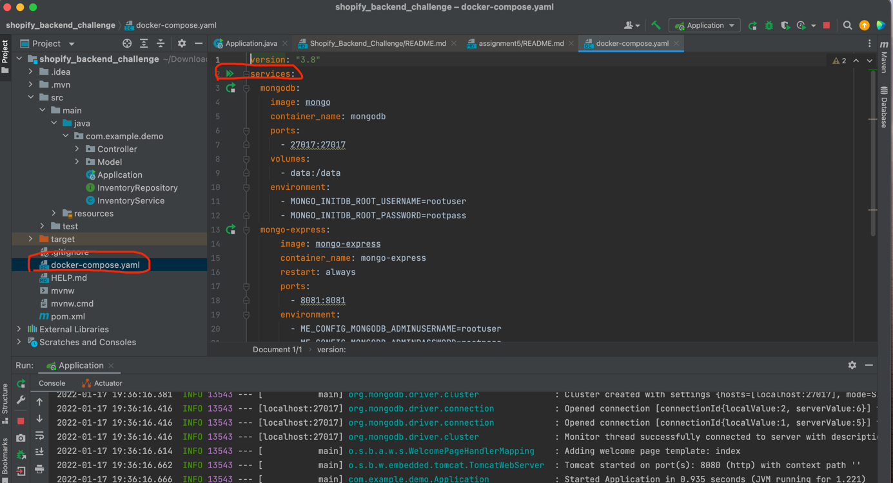

# Shopify_Backend_Challenge
# About:
This is a inventory tracking web application allow CRUD 
operations on inventories. And it also allows users to
search or filter inventories by fields/inventory count
/tags /other metadata I provide a simple frontend to 
display and test the operations on the database.

The backend technologies I used are SpringBoot + Mongodb, 
I use dock container to build the mongo database and 
communicate with spring boot.

The frontend comminicate with SpringBoot using Thymeleaf.

# How to run and test the web application:

## Tools:
We need to install the latest docker from the website: 
https://www.docker.com/products/docker-desktop

## Configure Database
After we cloned the project from here.

We need to open the docker-compose.yaml file to build the 
mongodb in a docker container.

