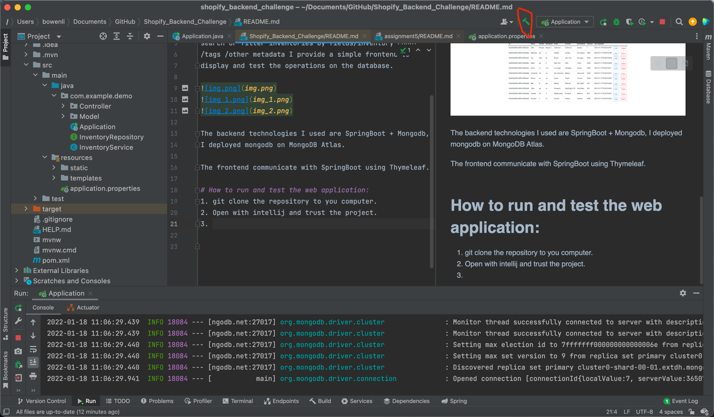
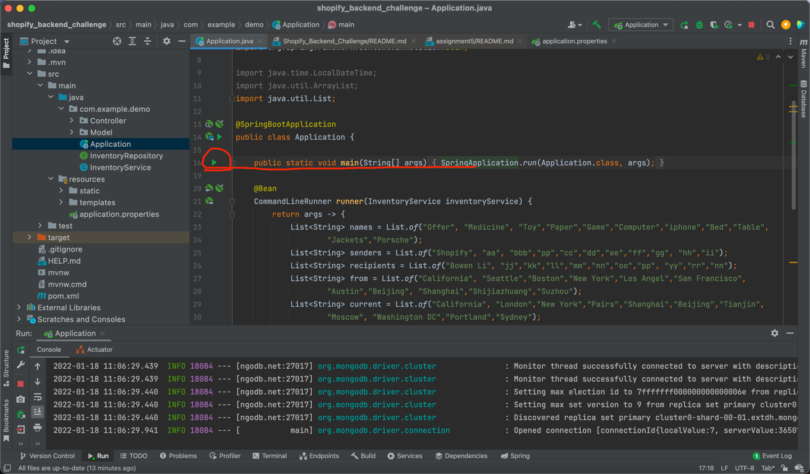
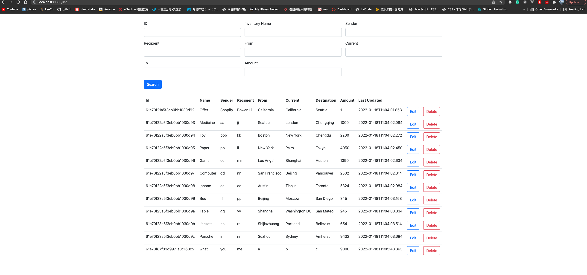

# Shopify_Backend_Challenge
# About:
This is a inventory tracking web application allow CRUD 
operations on inventories. And it also allows users to
search or filter inventories by fields/inventory count
/tags /other metadata I provide a simple frontend to 
display and test the operations on the database.

The backend technologies I used are SpringBoot + Mongodb, 
I deployed mongodb on MongoDB Atlas.

The frontend communicate with SpringBoot using Thymeleaf.

# How to run and test the web application:
1. git clone the repository to you computer.
2. Open with intellij and trust the project.
3. Build the project.

4. Run the Application

### I inserted 11 data for test, you can see them after click on show Inventories

