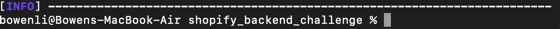

# Shopify_Backend_Challenge
# About:
This is a inventory tracking web application allow CRUD 
operations on inventories. And it also allows users to
search or filter inventories by fields/inventory count
/tags /other metadata I provide a simple frontend to 
display and test the operations on the database.

The backend technologies I used are SpringBoot + Mongodb, 
I deployed mongodb on MongoDB Atlas.

The frontend communicate with SpringBoot using Thymeleaf.

# How to run and test the web application:

## Prerequisite
This is a maven project, so we need to install maven first.
If you have Brew installed, you can just use the code below 
to install.

`brew install mvm`

## Run the project
1. git clone the repository to you computer.\
`git clone https://github.com/libowen203/Shopify_Backend_Challenge.git`
2. In the termnial, enter to the project repository, which is the lowercase file name.

3. Run the following command:\
`mvn spring-boot:run`

4. You could see the termnial like this, now the project is running
on http://localhost:8080/

### I inserted 11 data for test, you can see them after click on show Inventories

